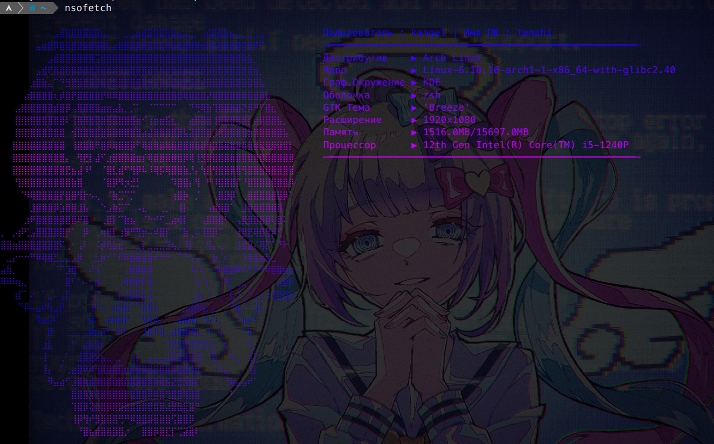

## Данный проект написан был по приколу , аля моя версия neofetch

___

> Написана она на Python,все бибилотеки написаны в __requments.txt__
> **ЗАПУСКАЕТСЯ ТОЛЬКО НА LINUX** УЧТИ ЭТО , на винде не робит да...

> __Установка__ :
>> __Debian and another distro:__
>> sudp apt install python3 git
>> git clone https://github.com/ArThirtyFour/nsofetch
>> cd nsofetch
>> pip install -r requments.txt
>> python da.py
>>
>> __Arch Linux and another distro:__
>> sudo pacman -S python3 git
>> git clone https://github.com/ArThirtyFour/nsofetch
>> cd nsofetch
>> pip install -r requments.txt
>> python da.py
__
## А как прописать команду , чтобы запускала скрипт не скажу , через ailas сделаешь :0