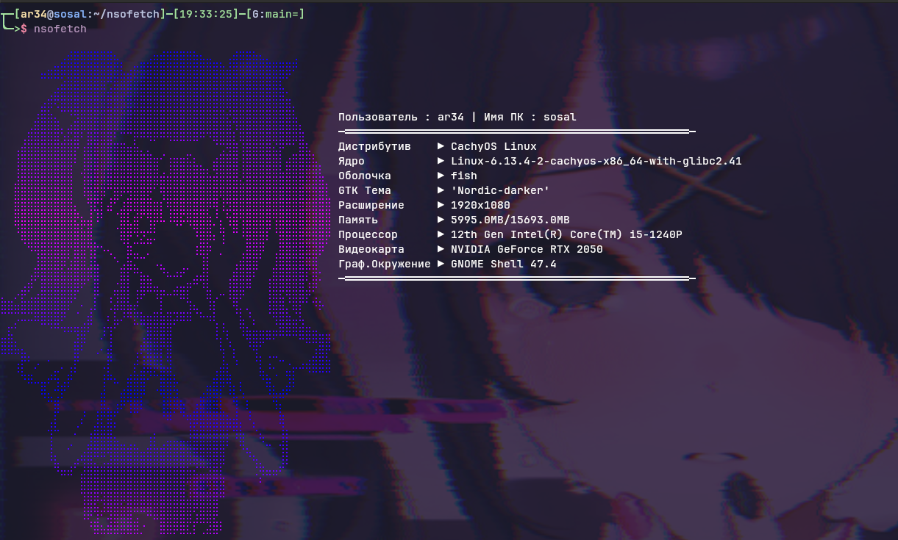

## Данный проект написан был по приколу , аля моя версия neofetch в стиле нсо ;)

___

> Написана она на Python,все бибилотеки написаны в __requments.txt__
> **ЗАПУСКАЕТСЯ ТОЛЬКО НА LINUX** УЧТИ ЭТО , на винде не робит да...

> __Установка__ :
>> Заходишь в Realses , там лежит бинарник и скачиваешь его
>>
>> Дальше заходи где лежит бинарник и пиши
>>
>> `sudo mv nsofetch /usr/local/bin/`
>>
>> Прописывай nsofetch и у тебя все появится